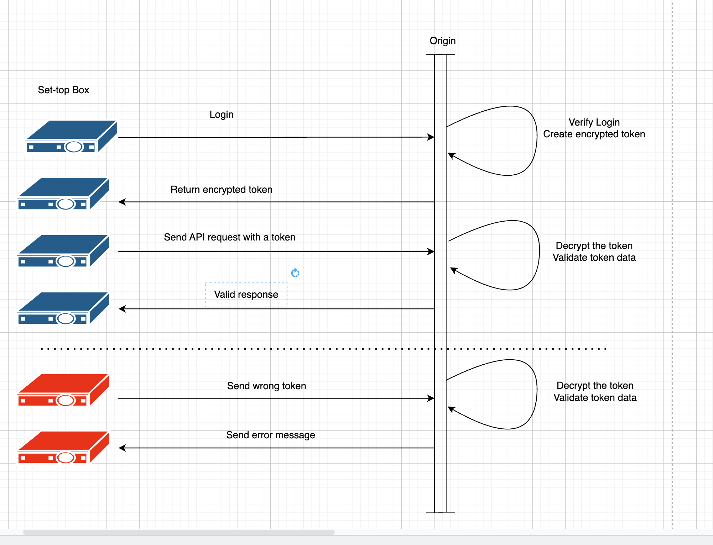

# Secure token validation at the edge

Modern CDN providers like [Amazon CloudFront](https://aws.amazon.com/cloudfront/), in addition to their traditional caching abilities, provide computation support. Specifically, they allow you to execute your code at the edge. Edge is a physical location that is closer to the client than the origin (AWS Region).

## Why is it important?

Some operations have repeatable functionality that we have to execute as part of our business flow. 

For example, if you use paid API requests, the backend (origin) needs to make sure that the request is valid. The validation of a request can influence the performance of your application since an additional overhead is needed by the CPU to perform the validation. Often, such a validation includes some kind of cryptographic operation. Working with cryptography algorithms is often considered a computationally heavy operation.

In addition, there is an impact on latency. We need to do the whole round trip to the origin just to discover that the validation process returns an "invalid" response. 

## Can we improve the process?

Very often, [AWS Lambda@Edge](https://aws.amazon.com/fr/lambda/edge/) is used to offload the validation process from the origin.

Lambda@Edge is located at CloudFront Regional Edge Caches which are situated within AWS Regions, between your applications’ web server and CloudFront Points of Presence (POPs) and embedded Points of Presence. CloudFront has 13 RECs globally (correct to the moment of publishing).

It means that Lambda@Edge is not located physically at the POP location. It provides benefits like direct access to regional assets and services and reduces latency.

In addition to Lambda@Edge, there is another technology called the [CloudFront function](https://docs.aws.amazon.com/AmazonCloudFront/latest/DeveloperGuide/cloudfront-functions.html) that can improve the process even further.

CloudFront functionality is more limited than Lambda@Edge. It cannot access the body of the request and supports only javascript runtime, but it is a good alternative If we want to offload computational overhead from the origin, specifically for the use case we present here. 

This is because the CloudFront function runs in the edge location, which makes the whole difference.


## Use-case decription

In our use case, we are going to imagine that we are a media company providing the control plan for live-streaming television. We have a lot of APIs in our application. For example, channel changes, content bookmarking, and catchup requests. All the requests are signed with a security token since our service is a paid service and we don't allow free access.

Our basic flow is simple:

1. On the login request, generate a security token and add it to the header of the response.

2. All subsequent requests send this header back to the origin.

3. The origin validates the header content and provides the desired response.

4. If the header is not valid, the origin sends the error back to the client.

It sounds simple, but having hundreds of thousands or even millions of subscribers is very common. It means that the total overhead of processing token validation is not neglected in our application. In addition, we also need to process the requests with invalid headers.

If we deep dive into the details, our process uses AES encryption to encrypt the token value before it goes into the header. It also means that the origin needs to handle all AES decryption for each request.

The high-level architecture looks like this:


and the basic flow we described looks like this:



Our architectural change will be very small, but it will have a lot of impact.

We will add the CloudFront function, which will do several things:

1. Forward the request without a token to the origin to get the token back.

2. Get the request with a token and validate it. If the token is valid, the request will be forwarded to the origin.

3. Get the request with a token and validate it. If the token is invalid, the "Unauthorized" response will be sent immediatelly to the client.

New architecture:


CloudFunction is being served before CloudFront. It will handle all the logic described above. In addition, we will use another feature of CloudFront: the KeyValue Store. This is a database that is also executed directly at the edge location, like the CloudFront function, and we will use it to store the encryption key. How exactly it gets there will be explained later. 

New flow:


In the new flow, we see that the request is being forwarded to the origin only if it is valid. Also, if the token is not valid, the request is being terminated immediately.


## Solution

Our solution is an [Amazon CDK](https://aws.amazon.com/cdk/) project that deploys all the components to demo the concept we presented above.

It deploys the following components:

 


1. A secret manager with an encryption key. The key is generated at runtime, and we don't know its value.
2. Lambda to insert the encryption key from secret management into the CloudFront KeyValue store. This lambda is being invoked automatically as part of the deployment process and puts the data from the secret manager to the CloudFron KeyValue Store.
3. Origin Lambda. This lambda simulates the origin in the architectural diagrams above. This lambda serves several purposes:

    a. Get the request without token data that returns the CURL command that the client needs to run with an encrypted token in the header.

    b.  The request with an encrypted token and a command to decrypt and validate the token. This simulates the current implementation without the CloudFront function. After this, Lambda will do some dummy work for 1-2 seconds to simulate the workload.

    c.  The request with an encrypted token and the command to skip the validation. After this, Lambda will do some dummy work for 1-2 seconds to simulate the workload.

4. Application Load Balancer, exactly as in the architectural diagram above, for better real-world simulation
5. CloudFront distribution with disabled cache, CloudFront function attached to distribution, and CloufFron KeyValue store. 

After deployment of the resource, you can find the URL to start. It will look like:


*Note!!* 
To simplify the example, we used the HTTP protocol. Don't use HTTPS. You will get an error.

The first request will return the CURL command, which will include the encrypted header and initiation vector for the AES-CBC alphorite that we used. 


Execute this command from your terminal.


 
You will see the output "Work Done." It means that the token was validated and Lambda processed the request without doing any additional decryption of the header in the token.

This example simplifies the use-case by using the hard-coded validation token "VALID" in the CloudFront function. Let's see what will happen if we change it to "NOT_VALID." I remind you that our encrypted token still holds the encrypted value "VALID,"  so we expect the validation to fail.


We will call the same CURL command as before.


As expected we got UnAuthorized error and the request was not forwarded to the origin.

If we remove the CloudFront function from the CloudFront distribution, we can directly guide the origin to decrypt and check the header. For this, we need to add the query string "validate=1' to the URL.


If you see "the request is valid,"  it means that the header was decrypted and tested for validity successfully.

# Deployment

**Note!!** We assume that AWS credentials are already being set up in your environment.

Clone this repository and change into the directory you created.

The `cdk.json` file tells the CDK Toolkit how to execute your app.

This project is set up like a standard Python project.  The initialization
process also creates a virtualenv within this project, stored under the `.venv`
directory.  To create the virtualenv it assumes that there is a `python3`
(or `python` for Windows) executable in your path with access to the `venv`
package. If for any reason the automatic creation of the virtualenv fails,
you can create the virtualenv manually.

To manually create a virtualenv on MacOS and Linux:

```
python3 -m venv .venv
```

After the init process completes and the virtualenv is created, you can use the following
step to activate your virtualenv.

```
source .venv/bin/activate
```

If you are a Windows platform, you would activate the virtualenv like this:

```
.venv\Scripts\activate.bat
```

Once the virtualenv is activated, you can install the required dependencies.

```
$ pip install -r requirements.txt
```

At this point you can now synthesize the CloudFormation template for this code.

```
cdk synth
```

To deploy the solution run this code.

```
cdk deploy
```

To undeploy the solution run this code.

```
cdk destroy
```

To add additional dependencies, for example other CDK libraries, just add
them to your `setup.py` file and rerun the `pip install -r requirements.txt`
command.

### Useful commands and references

 * `cdk ls`          list all stacks in the app
 * `cdk synth`       emits the synthesized CloudFormation template
 * `cdk deploy`      deploy this stack to your default AWS account/region
 * `cdk diff`        compare deployed stack with current state
 * `cdk docs`        open CDK documentation

 [Working with AWS CDK and Python](https://docs.aws.amazon.com/cdk/v2/guide/work-with-cdk-python.html).


